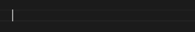

# Salesforce Snippets (Apex/LWC) README

## Introduction

Code snippets for Salesforce (Apex & LWC) directly in VS Code.

This contains the Trigger framework and many quick start for apex classes : Batches, Queuable...

The repository is Open Source, you can [contribute or modify snippets here.](https://github.com/yaacov9/salesforce-snippets--apex-lwc)
### How to use it ?
Simply use the prefix defined in the extension to trigger the snippet

## Features
### Apex Snippets
| # | Prefix | Description |
|----------|:---------:|---------:|
| 1  |  sys  |  System.debug |
| 2  |  /d  |  Apex Class description |
| 3  |  /dm  |  Apex method description |
| 4  |  /batch  |  Batch Class quick start |
| 2  |  /d  |  Apex Class description |
| 2  |  /d  |  Apex Class description |
| 2  |  /d  |  Apex Class description |
| 2  |  /d  |  Apex Class description |
| 2  |  /d  |  Apex Class description |
| 2  |  /d  |  Apex Class description |

## Release Notes
### 1.0.0

Initial release
- 27 Apex code Snippets
- 12 JS code Snippets for LWC
- 1 HTML code Snippets for LWC

---